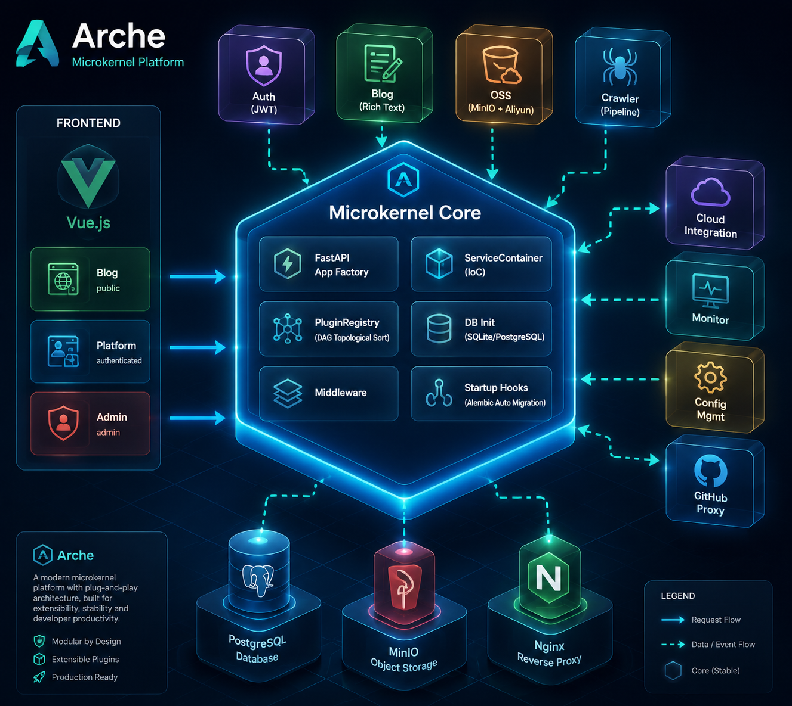

# Arche

> **核心万年不动，功能全部插件化。**

Arche 是一个个人模块化平台，采用微内核架构。所有功能以可插拔插件形式扩展，前端按角色按需下发代码 chunk。

[](LICENSE)[](https://github.com/Lumoa-dev/Arche/actions/workflows/ci.yml)[](https://www.python.org/)[](https://fastapi.tiangolo.com/)[](https://vuejs.org/)[](https://github.com/Lumoa-dev/Arche/commits/master)

 **线上地址**：[arche.lumoa.cn](https://arche.lumoa.cn)

---

## 架构总览



## 目录

- [项目简介](#项目简介)
- [架构设计](#架构设计)
- [技术栈](#技术栈)
- [核心特性](#核心特性)
- [内置插件](#内置插件)
- [快速开始](#快速开始)
- [测试](#测试)
- [部署](#部署)
- [项目结构](#项目结构)
- [贡献指南](#贡献指南)
- [许可证](#许可证)

---

## 项目简介

Arche 定位为**个人全栈工具箱**——把日常需要的小工具、小服务都做成插件，统一由一个内核调度。无论是写博客、存文件、跑爬虫、管监控，还是调云服务器，都在同一个平台里完成。

### 为什么做 Arche？

现有的方案要么太重（企业级框架学习成本高），要么太散（各个工具各自为战，没有统一入口）。Arche 的目标是：

- **一个内核，万物插件**——核心只做装配和调度，不做具体业务
- **按需加载**——前端按角色拆码，未登录用户看不到管理端代码
- **零摩擦扩展**——新增一个插件不改核心代码，重启即生效

## 架构设计

Arche 采用 **微内核（Microkernel）架构**，分为三层：

### 核心层（Core）

`backend/core/` 是"万年不动"的内核，负责应用的完整生命周期：

| 阶段 | 职责 |
|------|------|
| 日志配置 | 统一结构化日志（控制台 + 文件） |
| 数据库初始化 | 创建异步引擎和会话工厂（SQLite / PostgreSQL） |
| 依赖注入 | 自研 ServiceContainer（IoC），支持延迟实例化和循环依赖检测 |
| 插件激活 | 扫描 `plugins/` 目录，按 DAG 拓扑排序后依次激活 |
| 服务注册 | 每个插件将自身服务注册到容器 |
| 中间件装配 | CORS、安全头、错误处理、请求统计 |
| 启动钩子 | Alembic 自动迁移、Schema 校验、配置种子数据 |

### 插件层（Plugins）

`backend/plugins/*/` 每个插件自包含、自注册：

```
plugin-name/
├── __init__.py      # 插件类定义 + 自注册
├── routes.py        # FastAPI 路由
├── services.py      # 业务逻辑
└── models.py        # SQLAlchemy 模型
```

插件之间通过 `requires`（硬依赖）和 `optional`（软依赖）声明关系，启动时由内核自动拓扑排序：

```python
class BlogPlugin(BasePlugin):
    name = "blog"
    requires = ["auth"]       # auth 必须先激活
    optional = ["oss"]        # oss 增强体验，但不依赖
```

### 前端层（Frontend）

`frontend/` 基于 Vue 3 + TypeScript + Vite，按角色拆分为三个 chunk：

| 角色 | 加载范围 | 包含内容 |
|------|----------|----------|
| 游客/普通用户 | Blog 页面 | 文章浏览、搜索、评论 |
| 登录用户 | + Platform | 个人中心、收藏、设置 |
| 管理员 | + Admin | 内容审核、系统配置、监控面板 |

---

## 技术栈

| 层 | 技术 | 用途 |
|------|----------|------|
| **后端框架** | FastAPI 0.110+ | REST API |
| **ORM** | SQLAlchemy 2.x (async) | 数据访问 |
| **数据库** | SQLite (dev) / PostgreSQL (prod) | 持久化 |
| **DB 驱动** | aiosqlite / asyncpg | 异步连接 |
| **校验** | Pydantic v2 | 数据校验 |
| **DI 容器** | 自研 ServiceContainer | 依赖注入 |
| **迁移** | Alembic（启动时自动执行） | 数据库迁移 |
| **认证** | JWT（auth 插件） | 身份认证 |
| **对象存储** | MinIO / 阿里云 OSS（oss 插件） | 文件存储 |
| **前端框架** | Vue 3.5 + TypeScript | UI |
| **构建工具** | Vite | 前端构建 |
| **反向代理** | Nginx | 生产环境代理 + SSL |
| **部署** | Docker Compose | 容器化 |

---

## 核心特性

- **核心万年不动** — 基础层只负责装配和调度，不做具体业务。新增功能？加个插件就行，不动核心一行代码。
- **功能全部插件化** — 每个插件自包含、自注册，依赖关系通过 DAG 自动管理。想加什么加什么，想拆什么拆什么。
- **前端按需下发** — 不同角色拿到不同的 JS chunk。游客看不到管理后台的代码，管理员的 bundle 不会发给普通用户。
- **开发零摩擦** — 新增插件不改核心代码，目录放进去、重启即生效。Alembic 迁移在启动时自动执行，无需手动操作。

---

## 内置插件

| 插件 | 描述 | 状态 |
|------|------|------|
| **auth** | 用户认证（JWT）+ 在线会话追踪 | 可用 |
| **blog** | 博客系统，支持敏感词过滤、富文本编辑、段落评论、点赞收藏 | 可用 |
| **oss** | 对象存储（MinIO + 阿里云 OSS 冷热迁移） | 可用 |
| **crawler** | 网页爬虫，种子管理 + 智能调度 + 流水线处理 | 可用 |
| **cloud_integration** | 云训练管理（智星云 / 阿里云 ECS / Mock） | 可用 |
| **github_proxy** | GitHub API 代理，带缓存和限流 | 可用 |
| **system_monitor** | 系统资源监控（CPU / 内存 / 磁盘 / 网络 / 进程） | 可用 |
| **config_mgmt** | 运行时动态配置管理 | 可用 |
| **monitor** | 监控告警与通知模板 | 可用 |
| **deploy_webhook** | 部署 Webhook 回调 | 可用 |
| **asset_mgmt** | 资产管理 | 开发中 |
| **search** | 全文检索 | 可用 |

---

## 快速开始

### 前置条件

- Python 3.10+
- Node.js 18+
- npm 9+

### 安装与运行

```bash
# 克隆
git clone https://github.com/Lumoa-dev/Arche.git
cd Arche

# 后端
uv sync
cp .env.example .env   # 编辑 .env，至少设置 SECRET_KEY
uv run uvicorn backend.main:app --reload

# 前端（新终端）
cd frontend && npm install && npm run dev
```

前端访问 `http://localhost:5173`，后端 API 在 `http://localhost:8000`。

完整的开发环境搭建与调试指南见 [CONTRIBUTING.md](CONTRIBUTING.md)。

### 环境变量

| 变量 | 必填 | 说明 |
|------|------|------|
| `SECRET_KEY` | 是 | JWT 签名密钥，请使用随机字符串 |
| `DATABASE_URL` | 否 | 默认使用 SQLite，生产环境需配置 PostgreSQL |
| `CORS_ORIGINS` | 否 | 前端地址，开发环境默认 `http://localhost:5173` |

---

## 测试

```bash
# 全部后端测试
uv run pytest

# 快速运行（跳过覆盖率）
uv run pytest --no-cov -ra --tb=short

# 前端测试（单次运行）
cd frontend && npm run test:run
```

测试策略详见 [backend/tests/TEST_STRATEGY.md](backend/tests/TEST_STRATEGY.md)。

---

## 部署

### Docker Compose

```bash
docker compose up -d
```

包含 Nginx（反向代理 + SSL）、后端、PostgreSQL、MinIO 四个服务。

### 生产环境注意事项

1. 更换 `SECRET_KEY` 为随机字符串
2. 使用 PostgreSQL 替代 SQLite（修改 `DATABASE_URL`）
3. 配置 SSL 证书（挂载到 `/ssl` 目录）
4. 所有环境变量详见 `.env.example`

---

## 项目结构

```
Arche/
├── backend/                     # Python 后端
│   ├── core/                    # 微内核（万年不动）
│   │   ├── __init__.py          # create_app() 启动序列
│   │   ├── container.py         # ServiceContainer（IoC）
│   │   ├── plugin_registry.py   # 插件注册表 + DAG 拓扑排序
│   │   ├── db.py                # 数据库初始化
│   │   └── middleware.py        # 全局中间件
│   ├── plugins/                 # 插件目录（自发现）
│   │   ├── auth/                # 认证插件
│   │   ├── blog/                # 博客插件
│   │   ├── oss/                 # 对象存储插件
│   │   └── ...                  # 更多插件
│   └── main.py                  # FastAPI 入口
├── frontend/                    # Vue 3 前端
│   └── src/
│       ├── components/          # 组件（ui/blog/admin/user）
│       ├── layouts/             # 布局壳
│       ├── router/              # 路由（按角色拆分）
│       └── services/            # API 调用层
├── scripts/                     # 工具脚本
├── assets/                      # 静态资源（架构图等）
└── docker-compose.yml           # 生产部署
```

---

## 贡献指南

我们欢迎任何形式的贡献！

- **报告问题** → 提交 [Issue](https://github.com/Lumoa-dev/Arche/issues)
- **贡献代码** → 阅读 [CONTRIBUTING.md](CONTRIBUTING.md) 了解开发规范和 PR 流程
- **提出想法** → 在 Issue 中讨论或直接提交 PR

如果你对某个 Issue 感兴趣，可以在评论中说一声"我来处理"，我们会把它分配给你。

---

## 相关文档

- [CONTRIBUTING.md](CONTRIBUTING.md) — 贡献指南、开发环境搭建、Commit 规范
- [docs/](docs/) — 各模块架构与设计文档
- [backend/tests/TEST_STRATEGY.md](backend/tests/TEST_STRATEGY.md) — 后端测试策略
- [frontend/docs/api-call-policy.md](frontend/docs/api-call-policy.md) — 前端 API 调用规范

---

## 关于

- **作者**: [Lumoa-dev](https://github.com/Lumoa-dev)
- **联系**: jihanyang123@163.com
- **许可证**: [Apache License 2.0](LICENSE)
