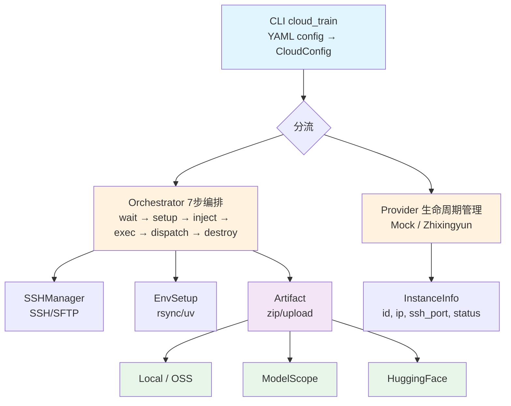
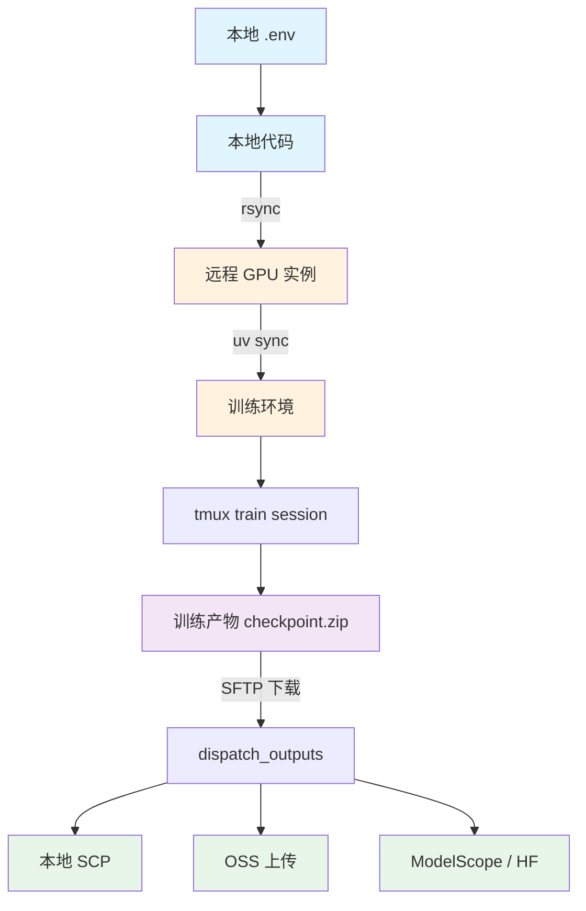

# 云集成架构设计文档

> 从现有代码反推（2026-04-17），标注了已知问题和待优化项。

## 1. 系统概述

云集成模块实现 **"创建实例 → 部署代码 → 远程训练 → 收集产物 → 销毁实例"** 的完整管线，当前聚焦智星云平台（Mock 用于本地调试）。

### 1.1 核心定位

- **训练管线的智能化集合**：本地数据清洗 → 云端 GPU 训练 → 产物自动回传
- **Provider 抽象**：统一接口对接不同云厂商，核心编排逻辑与具体厂商解耦
- **产物分发**：训练完成后自动分发到本地 / OSS / ModelScope / HuggingFace

### 1.2 非目标

- 不做数据处理（那是后续扩展方向）
- 不替代本地训练管线（`src/mindcore/training/`）
- 不做长期实例管理（用完即销毁）

---

## 2. 架构总览



---

## 3. 核心模块

### 3.1 CloudConfig（配置层）

```
src/cloud/config.py — CloudConfig dataclass
```

| 字段 | 默认值 | 说明 |
|------|--------|------|
| `provider` | `"zhixingyun"` | 后端提供商 |
| `instance_type` | `"a100"` | GPU 型号 |
| `spot` | `True` | 是否 Spot 实例 |
| `ssh_user` | `"root"` | SSH 用户名 |
| `ssh_port` | `0` | 0=自动检测 |
| `ssh_timeout` | `30` | 超时秒数 |
| `sync_method` | `"rsync"` | 代码同步方式 |
| `branch` | `"master"` | git 分支 |
| `output` | `["local"]` | 产物分发目标 |
| `auto_cleanup` | `True` | 训练后销毁实例 |
| `instance_timeout` | `600` | 实例超时秒数 |

**来源**：YAML 的 `cloud` 段 + CLI 覆盖参数合并。

### 3.2 Provider 抽象层

```
src/cloud/providers/base.py — BaseProvider (ABC)
```

```python
class BaseProvider(ABC):
    @abstractmethod
    def create_instance(config: CloudConfig) -> InstanceInfo: ...
    @abstractmethod
    def wait_ready(info: InstanceInfo) -> bool: ...
    @abstractmethod
    def destroy_instance(info: InstanceInfo) -> bool: ...
    @abstractmethod
    def list_instances() -> list[InstanceInfo]: ...
```

**职责边界**：只管计算生命周期，不碰数据、不碰产物。

**已实现 Provider**：

| Provider | 认证 | 创建逻辑 | 特点 |
|----------|------|---------|------|
| `mock` | 无 | 返回 localhost | 本地调试用 |
| `zhixingyun` | `ZXINGYUN_API_KEY` + `ZXINGYUN_API_SECRET` | 智星云 API，MD5 签名 | 支持 A100/V100，1h 默认 |

**注册机制**：`src/cloud/providers/__init__.py` 提供 `get_provider()` / `register_provider()` 工厂函数。

### 3.3 Orchestrator（编排层）

```
src/cloud/orchestrator.py — run_cloud_train()
```

7 步管线：

| 步骤 | 操作 | 模块 |
|------|------|------|
| 1 | 创建实例 | `provider.create_instance()` |
| 2 | 等待就绪 + 刷新连接 | `provider.wait_ready()` + SSHManager.connect() |
| 3 | 部署代码 | `setup_remote_env()` — rsync/git clone + uv sync |
| 4 | 注入环境变量 | `inject_env_vars()` — .env → ~/.mindcore_env |
| 5 | 执行训练 | SSH exec: `uv run mindcore train` (tmux session) |
| 6 | 下载并分发产物 | SFTP 下载 zip → `dispatch_outputs()` |
| 7 | 销毁实例 | `provider.destroy_instance()` |

**异常处理**：try/except/finally 包裹，`KeyboardInterrupt` 和 `Exception` 都触发清理，`auto_cleanup=True` 时自动销毁。

### 3.4 SSHManager（连接层）

```
src/cloud/ssh_manager.py — SSHManager (paramiko)
```

| 方法 | 功能 |
|------|------|
| `connect()` | 连接 + 重试 (max_retries=3, backoff) |
| `exec()` | 同步命令执行 |
| `exec_stream()` | tmux 分离式流执行，轮询输出，去重 |
| `upload_dir()` | SFTP 递归上传 |
| `check_ssh_reachable()` | 连接健康检查 |
| Context Manager | `with SSHManager(...) as ssh:` 自动 close |

**tmux 流执行设计**：训练命令跑在 `tmux new-session -d` 里，通过 `tmux capture-pane` 轮询输出。好处是 SSH 断线不影响训练进程。

### 3.5 EnvSetup（环境搭建）

```
src/cloud/env_setup.py
```

**代码同步**：
- rsync（默认）：排除 `.git`, `.venv`, `__pycache__`, `data`, `output`, `logs` 等
- git clone：指定 branch，适合大项目

**依赖安装**：
```
curl -LsSf https://astral.sh/uv/install.sh | sh    # ⚠️ MITM 风险
uv sync --group train
```

**项目根目录查找**：从 cwd 向上遍历，直到找到 `pyproject.toml`。

### 3.6 EnvInject（环境变量注入）

```
src/cloud/env_inject.py
```

- 从本地 `.env` 读取（python-dotenv）
- 写入远程 `~/.mindcore_env` 为 `export KEY=value` 格式
- 使用 `shlex.quote()` 安全转义
- 查找路径：显式路径 → cwd → 父目录（到 pyproject.toml 为止）
- 缺失变量生成 warning，不阻塞

### 3.7 Artifact（产物分发）

```
src/cloud/artifact.py
```

**打包**：`pack_outputs()` — zip 压缩 checkpoint 目录

**分发路由**（`dispatch_outputs()`）：根据 URL 前缀判断目标

| 前缀 | 目标 | 认证 |
|------|------|------|
| `local` / 无前缀 | SCP 下载 | SSH |
| `oss://` | 阿里云 OSS | `OSS_ACCESS_KEY_ID` + `OSS_ACCESS_KEY_SECRET` |
| `modelscope://` | ModelScope | `MODELSCOPE_API_KEY` |
| `hf://` | HuggingFace | HF token（库内处理） |

---

## 4. 数据流



---

## 5. 训练管线集成关系

### 5.1 本地 vs 云端

| 维度 | 本地训练 | 云端训练 |
|------|---------|---------|
| 入口 | `mindcore train` | `mindcore cloud_train` |
| 执行环境 | 本地 GPU | 远程 GPU 实例 |
| 产物上传 | 仅日志记录目标 | orchestrator 主动下载 + 分发 |
| 数据源 | 本地路径 | 本地路径（rsync 同步） |

### 5.2 独立 OSS 集成

`src/mindcore/training/storage.py` 提供了独立的 `upload_outputs()`：
- 支持本地路径和 `oss://` URL
- 使用 `oss2.resumable_upload()`（断点续传）
- 与 cloud/artifact.py 的 `bucket.put_object_from_file()` 不同

**当前状态**：本地训练管线仅记录输出目标，不主动调用上传。

---

## 6. 已知问题（TODO / 风险）

### 6.1 安全性

| # | 问题 | 位置 | 严重度 |
|---|------|------|--------|
| S1 | `curl | sh` 安装 uv 存在 MITM 风险 | env_setup.py | 中 |
| S2 | 凭据通过环境变量传递，无加密存储 | 多处 | 低 |
| S3 | SSH 私钥管理缺失，使用密码认证 | ssh_manager.py | 中 |
| S4 | 无产物完整性校验（checksum） | artifact.py | 低 |

### 6.2 稳定性

| # | 问题 | 位置 | 严重度 |
|---|------|------|--------|
| T1 | `region` 参数被忽略，硬编码使用默认区域 | zhixingyun.py | 低 |
| T2 | `hasattr(provider, "refresh_instance_connection")` 硬编码厂商特有方法 | orchestrator.py | 中 |
| T3 | `create_instance()` 返回空 IP/ssh_port，需 wait_ready 后刷新 | zhixingyun.py | 中 |
| T4 | SFTP 大文件传输无断点续传 | ssh_manager.py / artifact.py | 中 |
| T5 | 训练进程崩溃无自动重试 | orchestrator.py | 高 |
| T6 | 无实例创建失败后的资源泄漏检测 | orchestrator.py | 高 |

### 6.3 质量

| # | 问题 | 位置 | 严重度 |
|---|------|------|--------|
| Q1 | 无测试覆盖 | tests/ | 高 |
| Q2 | 模块导入路径 `from cloud.xxx` 依赖 sys.path | 多处 | 低 |
| Q3 | 错误信息不够友好，缺少 actionable 提示 | 多处 | 低 |
| Q4 | 无结构化日志，排查问题困难 | 多处 | 中 |
| Q5 | Provider 注册用字符串 key，拼写错误运行时才发现 | __init__.py | 低 |

### 6.4 功能缺失

| # | 问题 | 影响 |
|---|------|------|
| F1 | AutoDL Provider 未实现 | 无法使用 AutoDL 平台 |
| F3 | 无 GPU 监控 / 利用率采集 | 无法评估资源效率 |
| F4 | 无训练进度回调（webhook/通知） | 无法远程感知训练状态 |
| F5 | 数据源不支持 OSS 挂载 | 大数据集需本地 rsync |

---

## 7. 优化方向（待讨论）

### 7.1 短期（安全性 + 稳定性）

1. **替换 `curl | sh`**：预打包 uv 到 rsync 同步中，或使用 pipx / 静态二进制
2. **统一连接刷新接口**：在 BaseProvider 定义 `refresh_connection()` 方法
3. **产物校验**：打包时生成 SHA256 checksum，下载后验证
4. **SSH 密钥认证**：支持 SSH key 而非密码
5. **实例泄漏检测**：create 失败时兜底清理

### 7.2 中期（质量 + 可观测性）

1. **测试覆盖**：Mock Provider 单元测试 + orchestrator 集成测试
2. **结构化日志**：接入 Python logging，输出 JSON 格式日志
3. **GPU 监控**：训练期间轮询 nvidia-smi，记录利用率
4. **训练进度通知**：webhook / 邮件 / 微信推送
5. **断点续传**：SFTP + OSS 都支持 resumable upload

### 7.3 长期（功能扩展）

1. **AutoDL Provider**：对接 AutoDL 平台
3. **数据源 OSS 挂载**：大数据集直接从 OSS 挂载读取
4. **多实例并发训练**：并行创建多个实例跑超参搜索
5. **训练管线 + 数据处理管线统一**：云端不仅训练，也做数据清洗

---

## 8. v2 架构方案（待实施）

> 基于 5 份深度调研报告确定（2026-04-17），核心理念：代码/数据云端化 + 任务管理器 + Web 监控
>
> 调研依据：`docs/research/cloud-integration/` 下 5 份报告

### 8.1 核心变化

| 维度 | v1（现状） | v2 |
|------|-----------|----|
| **代码来源** | 本地 rsync 同步 | 远程 git clone（GitHub 私有仓库） |
| **数据来源** | 本地 rsync 同步 | ModelScope 私有数据集 |
| **产物回传** | SFTP 下载 | SFTP → 调度端暂存 → SHA256 校验 → 按需推 OSS |
| **调度方式** | CLI 一次性执行 | 任务管理器持续运行（只管状态记录，不抢调度） |
| **监控方式** | 终端 tmux 流输出 | Streamlit Web 面板 + 成本追踪 |
| **部署方式** | 本地跑 CLI | Docker 部署到 jamsyan.top 服务器 |
| **算力平台** | 智星云（v1 已有） | 智星云为主，Provider 抽象保留扩展 |

### 8.2 架构总览

```
┌──────────────────────────────────────────────────────────┐
│                  本地 / 手机 / 浏览器                      │
│                    Streamlit Web UI                       │
│  ┌──────────┐ ┌──────────┐ ┌──────────┐ ┌──────────┐     │
│  │ 任务列表  │ │ GPU指标  │ │ 费用估算  │ │ Loss曲线  │     │
│  └──────────┘ └──────────┘ └──────────┘ └──────────┘     │
└──────────────────────┬───────────────────────────────────┘
                       │ HTTP (st.fragment 2s 轮询)
                       ▼
┌──────────────────────────────────────────────────────────┐
│               任务管理器（jamsyan.top）                     │
│                   Docker 容器                            │
│  ┌──────────────┐  ┌──────────────┐  ┌───────────────┐  │
│  │  FastAPI     │  │  指标采集器   │  │  SQLite       │  │
│  │  REST API    │◄─┤  (SSH 轮询)  │  │  (任务状态 +   │  │
│  │              │  │  pynvml+正则  │  │   监控数据)    │  │
│  └──────┬───────┘  └──────┬───────┘  └───────┬───────┘  │
│         │                 │                   ▲          │
│         │  ┌──────────────┴──────┐            │          │
│         │  │  成本采集器          │            │          │
│         │  │  (智云星 API 60s)   │────────────┘          │
│         │  └─────────────────────┘                       │
└─────────┼────────────────────────────────────────────────┘
          │ SSH (paramiko)
          ├──────────────┬──────────────┐
          ▼              ▼              ▼
    ┌──────────┐   ┌──────────┐   ┌──────────┐
    │ 智星云实例A│   │ 智星云实例B│   │ 智星云实例C│
    │ (训练任务1)│   │ (训练任务2)│   │ (训练任务3)│
    └────┬─────┘   └────┬─────┘   └────┬─────┘
         │              │              │
         ▼              ▼              ▼
    ┌──────────┐   ┌──────────┐   ┌──────────┐
    │ git clone│   │ git clone│   │ git clone│
    │ ModelS.  │   │ ModelS.  │   │ ModelS.  │
    │ uv sync  │   │ uv sync  │   │ uv sync  │
    │ train    │   │ train    │   │ train    │
    │ SFTP回传 │   │ SFTP回传 │   │ SFTP回传 │
    └────┬─────┘   └────┬─────┘   └────┬─────┘
         │              │              │
         ▼              ▼              ▼
    ┌──────────────────────────────────────┐
    │       调度端产物暂存区                 │
    │  /app/outputs/task-001/              │
    │  ├── checkpoint.zip                  │
    │  ├── checkpoint.zip.sha256 ✓         │
    │  └── metrics.json (GPU + Loss 时序)   │
    └──────────────────┬───────────────────┘
                       │ 用户按需触发
                       ▼
                rsync / OSS 上传
```

### 8.3 任务管理器设计

**定位**：任务管理器不是调度器，是管家不是大脑。它只管：
- 记录任务状态
- 采集监控指标
- 采集费用数据
- 暂存训练产物
- 提供 Web UI 查询

**不抢 PAI-DLC / 智云星的调度活**：实例创建、销毁由智云星 API 直接控制。

**部署**：Docker 容器，跑在 `jamsyan.top` 服务器上

**技术栈**：

| 组件 | 选型 | 调研依据 |
|------|------|---------|
| API 框架 | FastAPI | [03-UI框架](../research/cloud-integration/03-监控面板UI框架调研.md) |
| GPU 监控 | pynvml (SSH 远程调用) | [04-GPU监控](../research/cloud-integration/04-GPU监控与指标采集调研.md) |
| 前端面板 | Streamlit (`st.fragment` 2s 轮询) | [03-UI框架](../research/cloud-integration/03-监控面板UI框架调研.md) |
| SSH 连接 | paramiko（现有 SSHManager） | 已有代码复用 |
| 产物校验 | SHA256 | [05-产物管理](../research/cloud-integration/05-云训练任务提交与产物管理.md) |

**核心接口**（FastAPI REST）：

| 端点 | 方法 | 功能 |
|------|------|------|
| `/api/tasks` | POST | 创建训练任务（指定 Provider、实例规格、训练配置） |
| `/api/tasks` | GET | 列出所有任务 |
| `/api/tasks/{id}` | GET | 获取任务详情 + 最新指标 |
| `/api/tasks/{id}/cancel` | POST | 取消任务 → 调用 Provider destroy |
| `/api/tasks/{id}/metrics` | GET | 获取 GPU + Loss 时序数据 |
| `/api/tasks/{id}/logs` | GET | 获取训练日志（最近 N 行） |
| `/api/costs` | GET | 费用汇总（实时） |
| `/api/providers` | GET | 可用 Provider 列表 |

**任务生命周期**：

```
PENDING → CREATING → RUNNING → DOWNLOADING → VERIFYING → COMPLETED
                            ↓                    ↓
                         FAILED              VERIFY_FAILED
                            ↓
                       CANCELLED
```

**状态说明**：

| 状态 | 说明 |
|------|------|
| PENDING | 任务已创建，等待实例启动 |
| CREATING | 智云星 API 正在创建实例 |
| RUNNING | 训练进行中，定时采集指标 |
| DOWNLOADING | 训练完成，SFTP 下载产物 |
| VERIFYING | SHA256 校验中 |
| COMPLETED | 校验通过，任务完成 |
| FAILED | 训练失败 / 实例异常 |
| VERIFY_FAILED | 产物校验失败，需人工介入 |
| CANCELLED | 用户主动取消 |

### 8.4 前端面板设计（Streamlit）

**页面布局**：

```
┌─ Sidebar ─────────────┬───────────────────────────────────┐
│  Provider 选择         │  总览指标                         │
│  实例规格选择          │  [运行中: 3] [总费用: ¥12.5]      │
│  训练配置加载          │                                   │
│  [提交任务] 按钮       │  任务列表                         │
│                        │  ┌─────┬──────┬──────┬────┬────┐ │
│                        │  │ ID  │ 状态 │ GPU% │Loss│ETA │ │
│                        │  ├─────┼──────┼──────┼────┼────┤ │
│                        │  │ 001 │ RUN  │ 95%  │0.23│2h  │ │
│                        │  │ 002 │ RUN  │ 88%  │0.45│1h  │ │
│                        │  │ 003 │ DOWN │ -    │ -  │ -  │ │
│                        │  └─────┴──────┴──────┴────┴────┘ │
│                        │                                   │
│                        │  Loss 曲线 (Plotly)               │
│                        │  [图表区域]                       │
│                        │                                   │
│                        │  GPU 指标 (Plotly)                │
│                        │  [利用率/显存/温度 三图并排]       │
│                        │                                   │
│                        │  费用趋势 (Plotly)                │
│                        │  [累计费用 vs 时间]                │
└────────────────────────┴───────────────────────────────────┘
```

**实时刷新**：使用 `st.fragment(run_every="2s")` 实现指标轮询，无需 WebSocket。

### 8.5 远程实例初始化流程（v2）

```
1. SSH 连接建立
2. git clone https://TOKEN@github.com/user/MindCore.git /opt/mindcore
3. modelscope download --dataset_id xxx --target_dir /opt/data
4. uv sync --group train
5. source ~/.mindcore_env  （环境变量注入）
6. uv run mindcore train --config /opt/mindcore/configs/train.yaml
7. 训练完成后打包：
   zip -r checkpoint.zip /mnt/output/checkpoints/
   sha256sum checkpoint.zip > checkpoint.zip.sha256
8. SFTP 下载 checkpoint.zip + checkpoint.zip.sha256
9. 调度端校验 SHA256
10. 校验通过 → COMPLETED，产物暂存 /app/outputs/task-{id}/
11. 销毁实例（调用智云星 stop_instance_with_refund API）
12. 用户按需从暂存区 rsync 回本地或推 OSS
```

### 8.6 监控数据采集

**GPU 指标**（远程实例侧，SSH 执行 pynvml 脚本，5秒轮询）：
- GPU 利用率（%）
- 显存使用 / 总计（bytes）
- 温度（°C）
- 功耗（W）

**训练进度**（SSH 正则提取 tmux 输出，10秒轮询）：
- epoch / step
- loss
- ETA

**成本数据**（智云星 API `get_instance_list` 查询，60秒轮询）：
- 实例运行时长
- 实时费用（基于 `Total_cost` 字段）
- 累计费用

**采集频率**：

| 指标 | 频率 | 方式 | 调研依据 |
|------|------|------|---------|
| GPU 指标 | 5秒 | pynvml 远程调用 | [04-GPU监控](../research/cloud-integration/04-GPU监控与指标采集调研.md) |
| 训练进度 | 10秒 | SSH 正则提取 tmux 输出 | [04-GPU监控](../research/cloud-integration/04-GPU监控与指标采集调研.md) |
| 实例状态 | 30秒 | 智云星 API | [01-算力对比](../research/cloud-integration/01-云厂商GPU算力对比.md) |
| 费用数据 | 60秒 | 智云星 API | [05-产物管理](../research/cloud-integration/05-云训练任务提交与产物管理.md) |

### 8.7 产物管理

**三级流转**：

```
远程实例 ──SFTP──▶ 调度端暂存 ──rsync/OSS──▶ 长期存储
```

| 阶段 | 操作 | 校验 |
|------|------|------|
| 远程打包 | zip + sha256sum | - |
| SFTP 下载 | 下载 zip + sha256 文件 | - |
| 暂存校验 | sha256sum --check | 失败 → VERIFY_FAILED |
| 长期存储 | 用户手动 rsync 回本地，或推 OSS | - |

**暂存区目录结构**：

```
/app/outputs/
├── task-20260417-001/
│   ├── checkpoint.zip
│   ├── checkpoint.zip.sha256
│   ├── metrics.json          # GPU + Loss 时序数据
│   └── train.log             # 训练日志
├── task-20260417-002/
│   └── ...
```

### 8.8 成本追踪

**实时费用计算**：

| 数据源 | 方式 |
|--------|------|
| 智云星 API | `get_instance_list` 返回 `Total_cost` 字段 |
| 本地估算 | 运行时长 × 单价（智星云 A100 80GB = 4.90 元/小时） |

**费用告警**（可选）：
- 单任务费用超过阈值（如 ¥50）→ 推送通知
- 日累计费用超过阈值 → 推送通知

### 8.9 Docker 部署

**任务管理器容器化**（部署在 jamsyan.top）：

```yaml
services:
  mindcore-task-manager:
    build: .
    ports:
      - "8000:8000"   # FastAPI
      - "8501:8501"   # Streamlit
    volumes:
      - ./data:/app/data          # SQLite 持久化
      - ~/.ssh:/root/.ssh:ro      # SSH 密钥只读挂载
      - ./outputs:/app/outputs    # 产物暂存
    env_file:
      - .env                      # GitHub PAT, ModelScope Token, 智云星密钥
    restart: unless-stopped
```

**环境变量**：

| 变量 | 用途 |
|------|------|
| `GITHUB_PAT` | 私有仓库拉取 |
| `MODELSCOPE_API_KEY` | 数据集下载 |
| `ZXINGYUN_API_KEY` | 智云星 API |
| `ZXINGYUN_API_SECRET` | 智云星 API |

### 8.10 调研依据与推荐方案

本节所有技术选型均基于 `docs/research/cloud-integration/` 下的深度调研报告：

| 决策点 | 推荐方案 | 调研报告 |
|--------|---------|---------|
| 算力平台 | 智星云为主，保留 Provider 抽象 | [01-云厂商GPU算力对比](../research/cloud-integration/01-云厂商GPU算力对比.md) |
| 任务管理 | FastAPI + SQLite，不做重型调度 | [02-训练任务调度框架调研](../research/cloud-integration/02-训练任务调度框架调研.md) |
| 监控 UI | Streamlit + `st.fragment` | [03-监控面板UI框架调研](../research/cloud-integration/03-监控面板UI框架调研.md) |
| GPU 监控 | pynvml SSH 远程调用 + SQLite | [04-GPU监控与指标采集调研](../research/cloud-integration/04-GPU监控与指标采集调研.md) |
| 产物管理 | SFTP + SHA256 + 暂存中转 | [05-云训练任务提交与产物管理](../research/cloud-integration/05-云训练任务提交与产物管理.md) |

---

## 9. 变更记录

| 日期 | 变更 |
|------|------|
| 2026-04-17 | 从代码反推初始版本 |
| 2026-04-17 | v2 架构方案更新：基于 5 份深度调研，清理 PAI-DLC 引用，调度端降级为任务管理器，新增产物中转层和成本追踪 |
